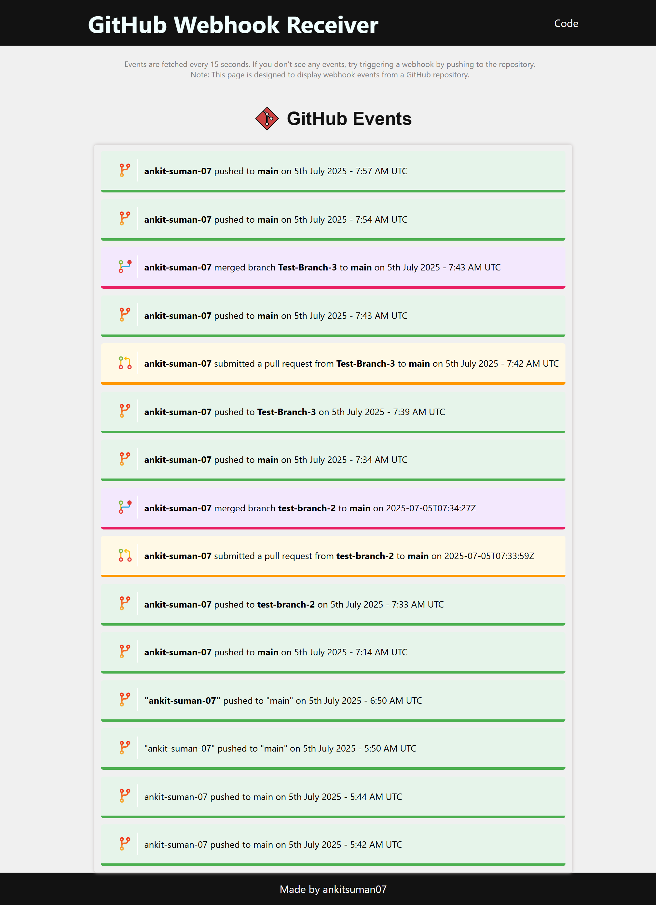
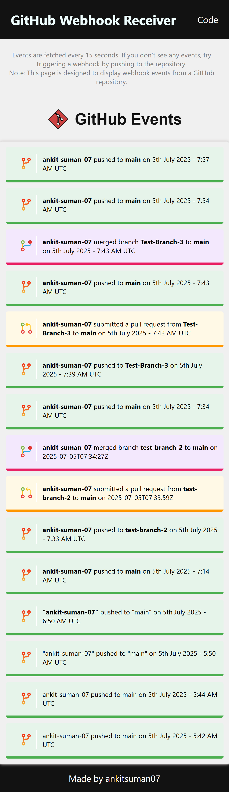

# UI for Flask Webhook

 A simple UI that polls polls the backend every 15 seconds and displays recent events in a human-readable format.

 - **Webhook Repo** : [https://github.com/ankit-suman-07/webhook-repo](https://github.com/ankit-suman-07/webhook-repo)
 - **Deployed UI** : [https://dazzling-mousse-419046.netlify.app/](https://dazzling-mousse-419046.netlify.app/)

 ***

 ## UI Screenshots

 - 
 ***
 - 
